# [📈 Live Status](https://status.icon.geometry.io): <!--live status--> **🟩 All systems operational**

This repository contains the open-source uptime monitor and status page for [Geometry Labs](https://status.icon.geometry.io), powered by [Upptime](https://github.com/upptime/upptime).

With [Upptime](https://upptime.js.org), you can get your own unlimited and free uptime monitor and status page, powered entirely by a GitHub repository. We use [Issues](https://github.com/geometry-labs/icon-status-page/issues) as incident reports, [Actions](https://github.com/geometry-labs/icon-status-page/actions) as uptime monitors, and [Pages](https://status.icon.geometry.io) for the status page.

<!--start: status pages-->
<!-- This summary is generated by Upptime (https://github.com/upptime/upptime) -->
<!-- Do not edit this manually, your changes will be overwritten -->
<!-- prettier-ignore -->
| URL | Status | History | Response Time | Uptime |
| --- | ------ | ------- | ------------- | ------ |
|  [Prod Mainnet Tracker Frontend](https://explorer.icon.geometry.io/) | 🟩 Up | [prod-mainnet-tracker-frontend.yml](https://github.com/geometry-labs/icon-status-page/commits/HEAD/history/prod-mainnet-tracker-frontend.yml) | 

 318ms
     
 | 

<a href="https://status.icon.geometry.io/history/prod-mainnet-tracker-frontend">99.61%</a>
    

|  [Prod Mainnet Blocks Service](https://explorer.icon.geometry.io/api/v1/blocks) | 🟩 Up | [prod-mainnet-blocks-service.yml](https://github.com/geometry-labs/icon-status-page/commits/HEAD/history/prod-mainnet-blocks-service.yml) | 

 1080ms
     
 | 

<a href="https://status.icon.geometry.io/history/prod-mainnet-blocks-service">98.87%</a>
    

|  [Prod Mainnet Transactions Service](https://explorer.icon.geometry.io/api/v1/transactions) | 🟩 Up | [prod-mainnet-transactions-service.yml](https://github.com/geometry-labs/icon-status-page/commits/HEAD/history/prod-mainnet-transactions-service.yml) | 

 1095ms
     
 | 

<a href="https://status.icon.geometry.io/history/prod-mainnet-transactions-service">98.88%</a>
    

|  [Prod Mainnet Logs Service](https://explorer.icon.geometry.io/api/v1/logs) | 🟩 Up | [prod-mainnet-logs-service.yml](https://github.com/geometry-labs/icon-status-page/commits/HEAD/history/prod-mainnet-logs-service.yml) | 

 1159ms
     
 | 

<a href="https://status.icon.geometry.io/history/prod-mainnet-logs-service">98.88%</a>
    

|  [Prod Mainnet Addresses Service](https://explorer.icon.geometry.io/api/v1/addresses) | 🟩 Up | [prod-mainnet-addresses-service.yml](https://github.com/geometry-labs/icon-status-page/commits/HEAD/history/prod-mainnet-addresses-service.yml) | 

 1095ms
     
 | 

<a href="https://status.icon.geometry.io/history/prod-mainnet-addresses-service">98.89%</a>
    

|  [Prod Mainnet Governance Service](https://explorer.icon.geometry.io/api/v1/preps) | 🟩 Up | [prod-mainnet-governance-service.yml](https://github.com/geometry-labs/icon-status-page/commits/HEAD/history/prod-mainnet-governance-service.yml) | 

 1116ms
     
 | 

<a href="https://status.icon.geometry.io/history/prod-mainnet-governance-service">98.89%</a>
    

|  [Prod Mainnet Contracts Service](https://explorer.icon.geometry.io/api/v1/contracts) | 🟩 Up | [prod-mainnet-contracts-service.yml](https://github.com/geometry-labs/icon-status-page/commits/HEAD/history/prod-mainnet-contracts-service.yml) | 

 1206ms
     
 | 

<a href="https://status.icon.geometry.io/history/prod-mainnet-contracts-service">98.90%</a>
    

|  [Prod Mainnet Metrics Service](https://explorer.icon.geometry.io/api/v1/metrics/supply) | 🟩 Up | [prod-mainnet-metrics-service.yml](https://github.com/geometry-labs/icon-status-page/commits/HEAD/history/prod-mainnet-metrics-service.yml) | 

 5264ms
     
 | 

<a href="https://status.icon.geometry.io/history/prod-mainnet-metrics-service">98.91%</a>
    

|  [Prod Sejong Tracker Frontend](https://explorer.icon.geometry.io/) | 🟩 Up | [prod-sejong-tracker-frontend.yml](https://github.com/geometry-labs/icon-status-page/commits/HEAD/history/prod-sejong-tracker-frontend.yml) | 

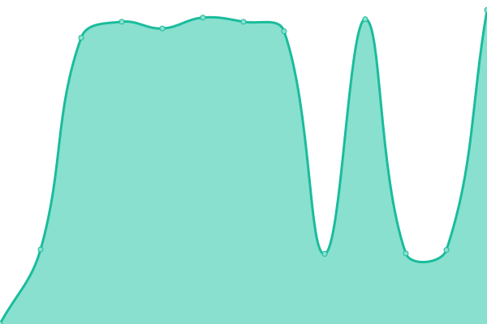 74ms
     
 | 

<a href="https://status.icon.geometry.io/history/prod-sejong-tracker-frontend">99.61%</a>
    

|  [Prod Sejong Blocks Service](https://explorer.icon.geometry.io/api/v1/blocks) | 🟩 Up | [prod-sejong-blocks-service.yml](https://github.com/geometry-labs/icon-status-page/commits/HEAD/history/prod-sejong-blocks-service.yml) | 

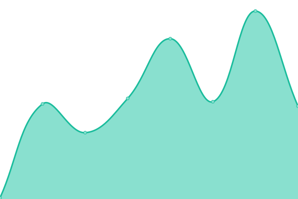 1084ms
     
 | 

<a href="https://status.icon.geometry.io/history/prod-sejong-blocks-service">98.91%</a>
    

|  [Prod Sejong Transactions Service](https://explorer.icon.geometry.io/api/v1/transactions) | 🟩 Up | [prod-sejong-transactions-service.yml](https://github.com/geometry-labs/icon-status-page/commits/HEAD/history/prod-sejong-transactions-service.yml) | 

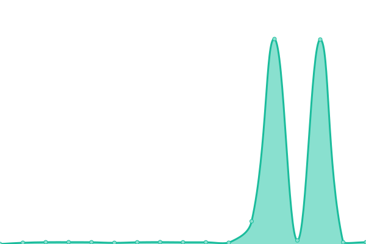 1088ms
     
 | 

<a href="https://status.icon.geometry.io/history/prod-sejong-transactions-service">98.92%</a>
    

|  [Prod Sejong Logs Service](https://explorer.icon.geometry.io/api/v1/logs) | 🟩 Up | [prod-sejong-logs-service.yml](https://github.com/geometry-labs/icon-status-page/commits/HEAD/history/prod-sejong-logs-service.yml) | 

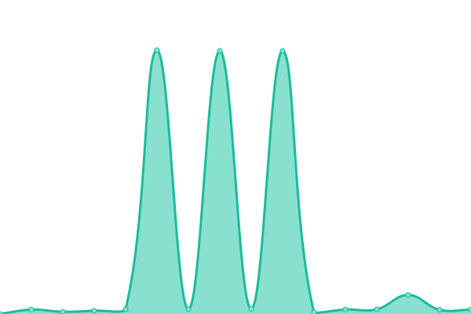 1143ms
     
 | 

<a href="https://status.icon.geometry.io/history/prod-sejong-logs-service">98.93%</a>
    

|  [Prod Sejong Addresses Service](https://explorer.icon.geometry.io/api/v1/addresses) | 🟩 Up | [prod-sejong-addresses-service.yml](https://github.com/geometry-labs/icon-status-page/commits/HEAD/history/prod-sejong-addresses-service.yml) | 

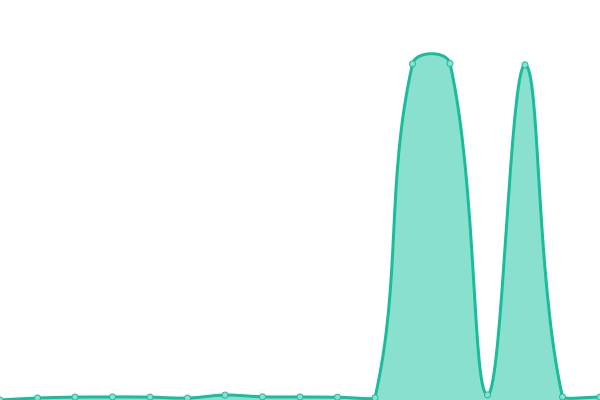 1086ms
     
 | 

<a href="https://status.icon.geometry.io/history/prod-sejong-addresses-service">98.93%</a>
    

|  [Prod Sejong Governance Service](https://explorer.icon.geometry.io/api/v1/preps) | 🟩 Up | [prod-sejong-governance-service.yml](https://github.com/geometry-labs/icon-status-page/commits/HEAD/history/prod-sejong-governance-service.yml) | 

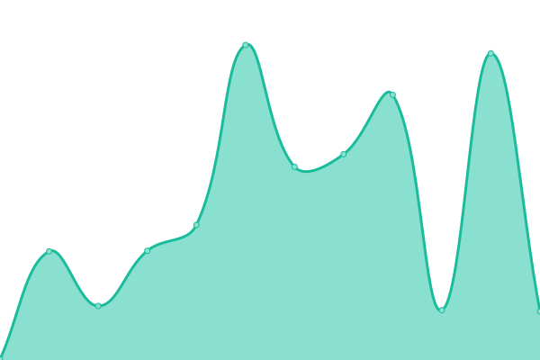 1293ms
     
 | 

<a href="https://status.icon.geometry.io/history/prod-sejong-governance-service">98.94%</a>
    

|  [Prod Sejong Contracts Service](https://explorer.icon.geometry.io/api/v1/contracts) | 🟩 Up | [prod-sejong-contracts-service.yml](https://github.com/geometry-labs/icon-status-page/commits/HEAD/history/prod-sejong-contracts-service.yml) | 

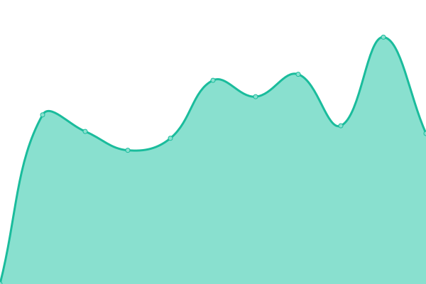 1207ms
     
 | 

<a href="https://status.icon.geometry.io/history/prod-sejong-contracts-service">98.95%</a>
    

|  [Prod Sejong Metrics Service](https://explorer.icon.geometry.io/api/v1/metrics/supply) | 🟩 Up | [prod-sejong-metrics-service.yml](https://github.com/geometry-labs/icon-status-page/commits/HEAD/history/prod-sejong-metrics-service.yml) | 

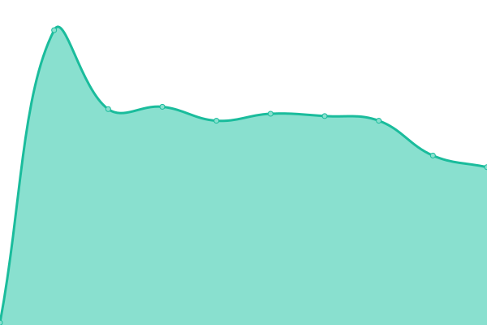 5284ms
     
 | 

<a href="https://status.icon.geometry.io/history/prod-sejong-metrics-service">98.95%</a>
    

|  [Dev Tracker Frontend](https://explorer.icon.geometry-dev.net/) | 🟩 Up | [dev-tracker-frontend.yml](https://github.com/geometry-labs/icon-status-page/commits/HEAD/history/dev-tracker-frontend.yml) | 

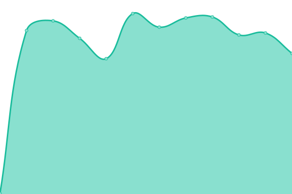 321ms
     
 | 

<a href="https://status.icon.geometry.io/history/dev-tracker-frontend">98.39%</a>
    

|  [Dev Blocks Service](https://explorer.icon.geometry-dev.net/api/v1/blocks) | 🟩 Up | [dev-blocks-service.yml](https://github.com/geometry-labs/icon-status-page/commits/HEAD/history/dev-blocks-service.yml) | 

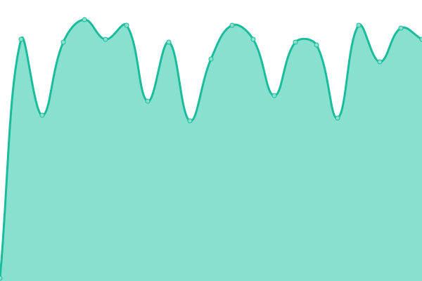 78ms
     
 | 

<a href="https://status.icon.geometry.io/history/dev-blocks-service">98.39%</a>
    

|  [Dev Transactions Service](https://explorer.icon.geometry-dev.net/api/v1/transactions) | 🟩 Up | [dev-transactions-service.yml](https://github.com/geometry-labs/icon-status-page/commits/HEAD/history/dev-transactions-service.yml) | 

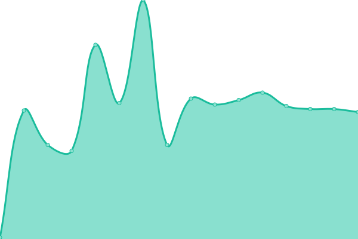 1092ms
     
 | 

<a href="https://status.icon.geometry.io/history/dev-transactions-service">98.04%</a>
    

|  [Dev Logs Service](https://explorer.icon.geometry-dev.net/api/v1/logs) | 🟩 Up | [dev-logs-service.yml](https://github.com/geometry-labs/icon-status-page/commits/HEAD/history/dev-logs-service.yml) | 

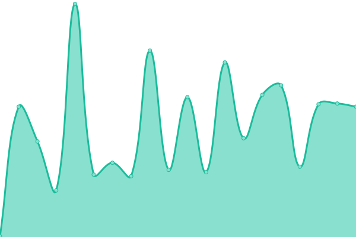 129ms
     
 | 

<a href="https://status.icon.geometry.io/history/dev-logs-service">98.39%</a>
    

|  [Dev Addresses Service](https://explorer.icon.geometry-dev.net/api/v1/addresses) | 🟩 Up | [dev-addresses-service.yml](https://github.com/geometry-labs/icon-status-page/commits/HEAD/history/dev-addresses-service.yml) | 

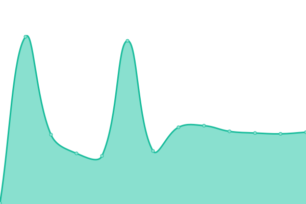 79ms
     
 | 

<a href="https://status.icon.geometry.io/history/dev-addresses-service">98.39%</a>
    

|  [Dev Governance Service](https://explorer.icon.geometry-dev.net/api/v1/preps) | 🟩 Up | [dev-governance-service.yml](https://github.com/geometry-labs/icon-status-page/commits/HEAD/history/dev-governance-service.yml) | 

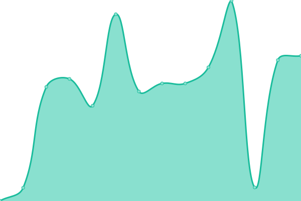 325ms
     
 | 

<a href="https://status.icon.geometry.io/history/dev-governance-service">98.31%</a>
    

|  [Dev Contracts Service](https://explorer.icon.geometry-dev.net/api/v1/contracts) | 🟩 Up | [dev-contracts-service.yml](https://github.com/geometry-labs/icon-status-page/commits/HEAD/history/dev-contracts-service.yml) | 

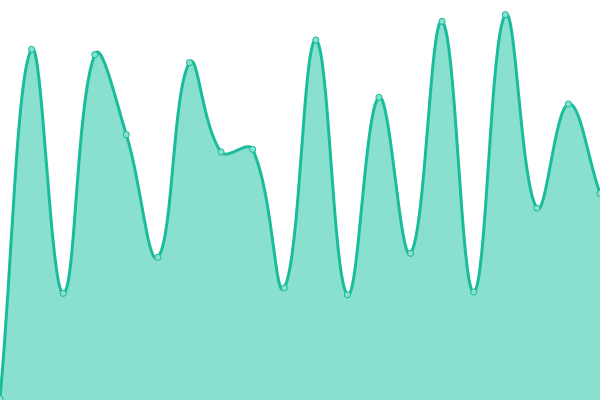 183ms
     
 | 

<a href="https://status.icon.geometry.io/history/dev-contracts-service">98.31%</a>
    

|  [Dev Metrics Service](https://explorer.icon.geometry-dev.net/api/v1/metrics/supply) | 🟩 Up | [dev-metrics-service.yml](https://github.com/geometry-labs/icon-status-page/commits/HEAD/history/dev-metrics-service.yml) | 

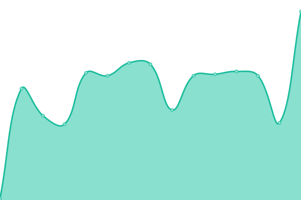 80ms
     
 | 

<a href="https://status.icon.geometry.io/history/dev-metrics-service">98.31%</a>
    

<!--end: status pages-->

[**Visit our status website →**](https://status.icon.geometry.io)

## 📄 License

- Powered by: [Upptime](https://github.com/upptime/upptime)
- Code: [MIT](./LICENSE) © [Geometry Labs](https://status.icon.geometry.io)
- Data in the `./history` directory: [Open Database License](https://opendatacommons.org/licenses/odbl/1-0/)
