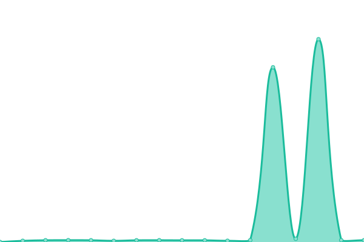
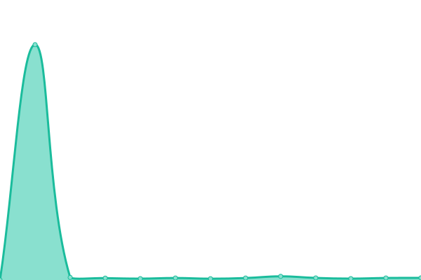
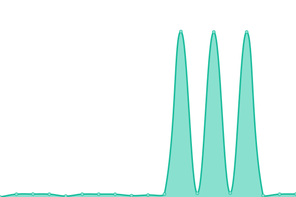
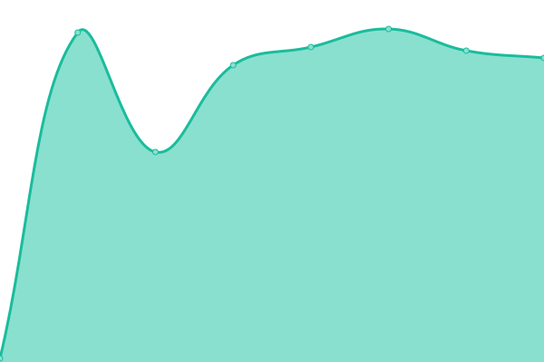
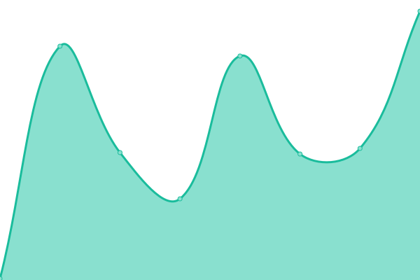
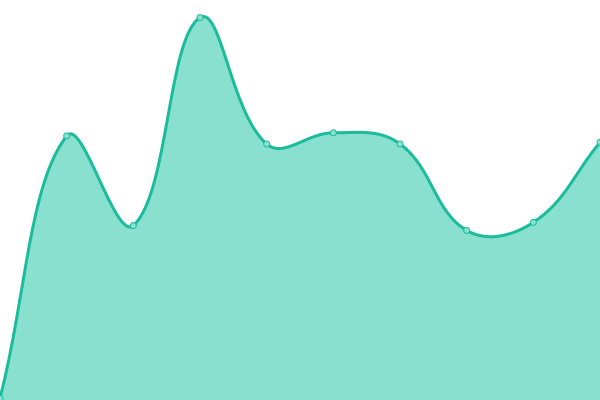

# [📈 Live Status](https://status.icon.geometry.io): <!--live status--> **🟩 All systems operational**

This repository contains the open-source uptime monitor and status page for [Geometry Labs](https://status.icon.geometry.io), powered by [Upptime](https://github.com/upptime/upptime).

With [Upptime](https://upptime.js.org), you can get your own unlimited and free uptime monitor and status page, powered entirely by a GitHub repository. We use [Issues](https://github.com/geometry-labs/icon-status-page/issues) as incident reports, [Actions](https://github.com/geometry-labs/icon-status-page/actions) as uptime monitors, and [Pages](https://status.icon.geometry.io) for the status page.

<!--start: status pages-->
<!-- This summary is generated by Upptime (https://github.com/upptime/upptime) -->
<!-- Do not edit this manually, your changes will be overwritten -->
<!-- prettier-ignore -->
| URL | Status | History | Response Time | Uptime |
| --- | ------ | ------- | ------------- | ------ |
|  [Prod ICON RPC](https://api.icon.geometry.io/api/v3) | 🟩 Up | [prod-icon-rpc.yml](https://github.com/geometry-labs/icon-status-page/commits/HEAD/history/prod-icon-rpc.yml) | 

 356ms
     
 | 

<a href="https://status.icon.geometry.io/history/prod-icon-rpc">100.00%</a>
    

|  [Prod Mainnet Tracker Frontend](https://tracker.icon.community/) | 🟩 Up | [prod-mainnet-tracker-frontend.yml](https://github.com/geometry-labs/icon-status-page/commits/HEAD/history/prod-mainnet-tracker-frontend.yml) | 

 415ms
     
 | 

<a href="https://status.icon.geometry.io/history/prod-mainnet-tracker-frontend">100.00%</a>
    

|  [Prod Mainnet Blocks Service](https://tracker.icon.community/api/v1/blocks) | 🟩 Up | [prod-mainnet-blocks-service.yml](https://github.com/geometry-labs/icon-status-page/commits/HEAD/history/prod-mainnet-blocks-service.yml) | 

 82ms
     
 | 

<a href="https://status.icon.geometry.io/history/prod-mainnet-blocks-service">100.00%</a>
    

|  [Prod Mainnet Transactions Service](https://tracker.icon.community/api/v1/transactions) | 🟩 Up | [prod-mainnet-transactions-service.yml](https://github.com/geometry-labs/icon-status-page/commits/HEAD/history/prod-mainnet-transactions-service.yml) | 

 81ms
     
 | 

<a href="https://status.icon.geometry.io/history/prod-mainnet-transactions-service">100.00%</a>
    

|  [Prod Mainnet Logs Service](https://tracker.icon.community/api/v1/logs) | 🟩 Up | [prod-mainnet-logs-service.yml](https://github.com/geometry-labs/icon-status-page/commits/HEAD/history/prod-mainnet-logs-service.yml) | 

 158ms
     
 | 

<a href="https://status.icon.geometry.io/history/prod-mainnet-logs-service">100.00%</a>
    

|  [Prod Mainnet Addresses Service](https://tracker.icon.community/api/v1/addresses) | 🟩 Up | [prod-mainnet-addresses-service.yml](https://github.com/geometry-labs/icon-status-page/commits/HEAD/history/prod-mainnet-addresses-service.yml) | 

 82ms
     
 | 

<a href="https://status.icon.geometry.io/history/prod-mainnet-addresses-service">100.00%</a>
    

|  [Prod Mainnet Governance Service](https://tracker.icon.community/api/v1/preps) | 🟩 Up | [prod-mainnet-governance-service.yml](https://github.com/geometry-labs/icon-status-page/commits/HEAD/history/prod-mainnet-governance-service.yml) | 

 480ms
     
 | 

<a href="https://status.icon.geometry.io/history/prod-mainnet-governance-service">100.00%</a>
    

|  [Prod Mainnet Contracts Service](https://tracker.icon.community/api/v1/contracts) | 🟩 Up | [prod-mainnet-contracts-service.yml](https://github.com/geometry-labs/icon-status-page/commits/HEAD/history/prod-mainnet-contracts-service.yml) | 

 742ms
     
 | 

<a href="https://status.icon.geometry.io/history/prod-mainnet-contracts-service">100.00%</a>
    

|  [Prod Mainnet Metrics Service](https://tracker.icon.community/api/v1/metrics/supply) | 🟩 Up | [prod-mainnet-metrics-service.yml](https://github.com/geometry-labs/icon-status-page/commits/HEAD/history/prod-mainnet-metrics-service.yml) | 

 86ms
     
 | 

<a href="https://status.icon.geometry.io/history/prod-mainnet-metrics-service">100.00%</a>
    

|  [US Mainnet Tracker Frontend](https://usw2.tracker.icon.geometry.io/) | 🟩 Up | [us-mainnet-tracker-frontend.yml](https://github.com/geometry-labs/icon-status-page/commits/HEAD/history/us-mainnet-tracker-frontend.yml) | 

 744ms
     
 | 

<a href="https://status.icon.geometry.io/history/us-mainnet-tracker-frontend">100.00%</a>
    

|  [US Mainnet Blocks Service](https://usw2.tracker.icon.geometry.io/api/v1/blocks) | 🟩 Up | [us-mainnet-blocks-service.yml](https://github.com/geometry-labs/icon-status-page/commits/HEAD/history/us-mainnet-blocks-service.yml) | 

 82ms
     
 | 

<a href="https://status.icon.geometry.io/history/us-mainnet-blocks-service">100.00%</a>
    

|  [US Mainnet Transactions Service](https://usw2.tracker.icon.geometry.io/api/v1/transactions) | 🟩 Up | [us-mainnet-transactions-service.yml](https://github.com/geometry-labs/icon-status-page/commits/HEAD/history/us-mainnet-transactions-service.yml) | 

 80ms
     
 | 

<a href="https://status.icon.geometry.io/history/us-mainnet-transactions-service">100.00%</a>
    

|  [US Mainnet Logs Service](https://usw2.tracker.icon.geometry.io/api/v1/logs) | 🟩 Up | [us-mainnet-logs-service.yml](https://github.com/geometry-labs/icon-status-page/commits/HEAD/history/us-mainnet-logs-service.yml) | 

 158ms
     
 | 

<a href="https://status.icon.geometry.io/history/us-mainnet-logs-service">100.00%</a>
    

|  [US Mainnet Addresses Service](https://usw2.tracker.icon.geometry.io/api/v1/addresses) | 🟩 Up | [us-mainnet-addresses-service.yml](https://github.com/geometry-labs/icon-status-page/commits/HEAD/history/us-mainnet-addresses-service.yml) | 

 81ms
     
 | 

<a href="https://status.icon.geometry.io/history/us-mainnet-addresses-service">100.00%</a>
    

|  [US Mainnet Governance Service](https://usw2.tracker.icon.geometry.io/api/v1/preps) | 🟩 Up | [us-mainnet-governance-service.yml](https://github.com/geometry-labs/icon-status-page/commits/HEAD/history/us-mainnet-governance-service.yml) | 

 480ms
     
 | 

<a href="https://status.icon.geometry.io/history/us-mainnet-governance-service">100.00%</a>
    

|  [US Mainnet Contracts Service](https://usw2.tracker.icon.geometry.io/api/v1/contracts) | 🟩 Up | [us-mainnet-contracts-service.yml](https://github.com/geometry-labs/icon-status-page/commits/HEAD/history/us-mainnet-contracts-service.yml) | 

 741ms
     
 | 

<a href="https://status.icon.geometry.io/history/us-mainnet-contracts-service">100.00%</a>
    

|  [US Prod Mainnet Metrics Service](https://usw2.tracker.icon.geometry.io/api/v1/metrics/supply) | 🟩 Up | [us-prod-mainnet-metrics-service.yml](https://github.com/geometry-labs/icon-status-page/commits/HEAD/history/us-prod-mainnet-metrics-service.yml) | 

 84ms
     
 | 

<a href="https://status.icon.geometry.io/history/us-prod-mainnet-metrics-service">100.00%</a>
    

|  [EU Mainnet Tracker Frontend](https://euw1.tracker.icon.geometry.io/) | 🟩 Up | [eu-mainnet-tracker-frontend.yml](https://github.com/geometry-labs/icon-status-page/commits/HEAD/history/eu-mainnet-tracker-frontend.yml) | 

 314ms
     
 | 

<a href="https://status.icon.geometry.io/history/eu-mainnet-tracker-frontend">100.00%</a>
    

|  [EU Mainnet Blocks Service](https://euw1.tracker.icon.geometry.io/api/v1/blocks) | 🟩 Up | [eu-mainnet-blocks-service.yml](https://github.com/geometry-labs/icon-status-page/commits/HEAD/history/eu-mainnet-blocks-service.yml) | 

 85ms
     
 | 

<a href="https://status.icon.geometry.io/history/eu-mainnet-blocks-service">100.00%</a>
    

|  [EU Mainnet Transactions Service](https://euw1.tracker.icon.geometry.io/api/v1/transactions) | 🟩 Up | [eu-mainnet-transactions-service.yml](https://github.com/geometry-labs/icon-status-page/commits/HEAD/history/eu-mainnet-transactions-service.yml) | 

 1204ms
     
 | 

<a href="https://status.icon.geometry.io/history/eu-mainnet-transactions-service">99.54%</a>
    

|  [EU Mainnet Logs Service](https://euw1.tracker.icon.geometry.io/api/v1/logs) | 🟩 Up | [eu-mainnet-logs-service.yml](https://github.com/geometry-labs/icon-status-page/commits/HEAD/history/eu-mainnet-logs-service.yml) | 

 163ms
     
 | 

<a href="https://status.icon.geometry.io/history/eu-mainnet-logs-service">100.00%</a>
    

|  [EU Mainnet Addresses Service](https://euw1.tracker.icon.geometry.io/api/v1/addresses) | 🟩 Up | [eu-mainnet-addresses-service.yml](https://github.com/geometry-labs/icon-status-page/commits/HEAD/history/eu-mainnet-addresses-service.yml) | 

 84ms
     
 | 

<a href="https://status.icon.geometry.io/history/eu-mainnet-addresses-service">100.00%</a>
    

|  [EU Mainnet Governance Service](https://euw1.tracker.icon.geometry.io/api/v1/preps) | 🟩 Up | [eu-mainnet-governance-service.yml](https://github.com/geometry-labs/icon-status-page/commits/HEAD/history/eu-mainnet-governance-service.yml) | 

 506ms
     
 | 

<a href="https://status.icon.geometry.io/history/eu-mainnet-governance-service">100.00%</a>
    

|  [EU Mainnet Contracts Service](https://euw1.tracker.icon.geometry.io/api/v1/contracts) | 🟩 Up | [eu-mainnet-contracts-service.yml](https://github.com/geometry-labs/icon-status-page/commits/HEAD/history/eu-mainnet-contracts-service.yml) | 

 760ms
     
 | 

<a href="https://status.icon.geometry.io/history/eu-mainnet-contracts-service">100.00%</a>
    

|  [EU Prod Mainnet Metrics Service](https://euw1.tracker.icon.geometry.io/api/v1/metrics/supply) | 🟩 Up | [eu-prod-mainnet-metrics-service.yml](https://github.com/geometry-labs/icon-status-page/commits/HEAD/history/eu-prod-mainnet-metrics-service.yml) | 

 87ms
     
 | 

<a href="https://status.icon.geometry.io/history/eu-prod-mainnet-metrics-service">100.00%</a>
    

<!--end: status pages-->

[**Visit our status website →**](https://status.icon.geometry.io)

## 📄 License

- Powered by: [Upptime](https://github.com/upptime/upptime)
- Code: [MIT](./LICENSE) © [Geometry Labs](https://status.icon.geometry.io)
- Data in the `./history` directory: [Open Database License](https://opendatacommons.org/licenses/odbl/1-0/)
