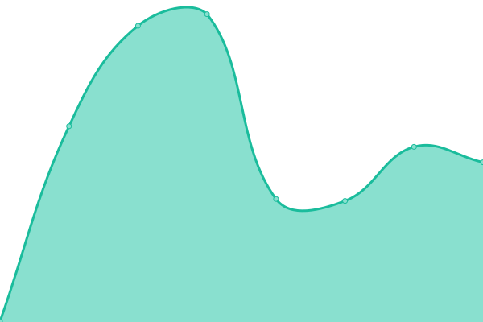

# [📈 Live Status](https://status.icon.geometry.io): <!--live status--> **🟩 All systems operational**

This repository contains the open-source uptime monitor and status page for [Geometry Labs](https://status.icon.geometry.io), powered by [Upptime](https://github.com/upptime/upptime).

With [Upptime](https://upptime.js.org), you can get your own unlimited and free uptime monitor and status page, powered entirely by a GitHub repository. We use [Issues](https://github.com/geometry-labs/icon-status-page/issues) as incident reports, [Actions](https://github.com/geometry-labs/icon-status-page/actions) as uptime monitors, and [Pages](https://status.icon.geometry.io) for the status page.

<!--start: status pages-->
<!-- This summary is generated by Upptime (https://github.com/upptime/upptime) -->
<!-- Do not edit this manually, your changes will be overwritten -->
<!-- prettier-ignore -->
| URL | Status | History | Response Time | Uptime |
| --- | ------ | ------- | ------------- | ------ |
|  [Prod Mainnet Tracker Frontend](https://tracker.icon.community/) | 🟩 Up | [prod-mainnet-tracker-frontend.yml](https://github.com/geometry-labs/icon-status-page/commits/HEAD/history/prod-mainnet-tracker-frontend.yml) | 

 950ms
     
 | 

<a href="https://status.icon.geometry.io/history/prod-mainnet-tracker-frontend">85.51%</a>
    

|  [Prod Mainnet Blocks Service](https://tracker.icon.community/api/v1/blocks) | 🟩 Up | [prod-mainnet-blocks-service.yml](https://github.com/geometry-labs/icon-status-page/commits/HEAD/history/prod-mainnet-blocks-service.yml) | 

 1640ms
     
 | 

<a href="https://status.icon.geometry.io/history/prod-mainnet-blocks-service">84.65%</a>
    

|  [Prod Mainnet Transactions Service](https://tracker.icon.community/api/v1/transactions) | 🟩 Up | [prod-mainnet-transactions-service.yml](https://github.com/geometry-labs/icon-status-page/commits/HEAD/history/prod-mainnet-transactions-service.yml) | 

 2500ms
     
 | 

<a href="https://status.icon.geometry.io/history/prod-mainnet-transactions-service">84.74%</a>
    

|  [Prod Mainnet Logs Service](https://tracker.icon.community/api/v1/logs) | 🟩 Up | [prod-mainnet-logs-service.yml](https://github.com/geometry-labs/icon-status-page/commits/HEAD/history/prod-mainnet-logs-service.yml) | 

 2297ms
     
 | 

<a href="https://status.icon.geometry.io/history/prod-mainnet-logs-service">84.63%</a>
    

|  [Prod Mainnet Addresses Service](https://tracker.icon.community/api/v1/addresses) | 🟩 Up | [prod-mainnet-addresses-service.yml](https://github.com/geometry-labs/icon-status-page/commits/HEAD/history/prod-mainnet-addresses-service.yml) | 

 2976ms
     
 | 

<a href="https://status.icon.geometry.io/history/prod-mainnet-addresses-service">82.97%</a>
    

|  [Prod Mainnet Governance Service](https://tracker.icon.community/api/v1/preps) | 🟩 Up | [prod-mainnet-governance-service.yml](https://github.com/geometry-labs/icon-status-page/commits/HEAD/history/prod-mainnet-governance-service.yml) | 

 2048ms
     
 | 

<a href="https://status.icon.geometry.io/history/prod-mainnet-governance-service">84.77%</a>
    

|  [Prod Mainnet Contracts Service](https://tracker.icon.community/api/v1/contracts) | 🟩 Up | [prod-mainnet-contracts-service.yml](https://github.com/geometry-labs/icon-status-page/commits/HEAD/history/prod-mainnet-contracts-service.yml) | 

 1957ms
     
 | 

<a href="https://status.icon.geometry.io/history/prod-mainnet-contracts-service">84.78%</a>
    

|  [US Mainnet Tracker Frontend](https://usw2.tracker.icon.geometry.io/) | 🟩 Up | [us-mainnet-tracker-frontend.yml](https://github.com/geometry-labs/icon-status-page/commits/HEAD/history/us-mainnet-tracker-frontend.yml) | 

 532ms
     
 | 

<a href="https://status.icon.geometry.io/history/us-mainnet-tracker-frontend">100.00%</a>
    

|  [US Mainnet Blocks Service](https://usw2.tracker.icon.geometry.io/api/v1/blocks) | 🟩 Up | [us-mainnet-blocks-service.yml](https://github.com/geometry-labs/icon-status-page/commits/HEAD/history/us-mainnet-blocks-service.yml) | 

 96ms
     
 | 

<a href="https://status.icon.geometry.io/history/us-mainnet-blocks-service">100.00%</a>
    

|  [US Mainnet Transactions Service](https://usw2.tracker.icon.geometry.io/api/v1/transactions) | 🟩 Up | [us-mainnet-transactions-service.yml](https://github.com/geometry-labs/icon-status-page/commits/HEAD/history/us-mainnet-transactions-service.yml) | 

 120ms
     
 | 

<a href="https://status.icon.geometry.io/history/us-mainnet-transactions-service">100.00%</a>
    

|  [US Mainnet Logs Service](https://usw2.tracker.icon.geometry.io/api/v1/logs) | 🟩 Up | [us-mainnet-logs-service.yml](https://github.com/geometry-labs/icon-status-page/commits/HEAD/history/us-mainnet-logs-service.yml) | 

 187ms
     
 | 

<a href="https://status.icon.geometry.io/history/us-mainnet-logs-service">100.00%</a>
    

|  [US Mainnet Addresses Service](https://usw2.tracker.icon.geometry.io/api/v1/addresses) | 🟩 Up | [us-mainnet-addresses-service.yml](https://github.com/geometry-labs/icon-status-page/commits/HEAD/history/us-mainnet-addresses-service.yml) | 

 113ms
     
 | 

<a href="https://status.icon.geometry.io/history/us-mainnet-addresses-service">100.00%</a>
    

|  [US Mainnet Governance Service](https://usw2.tracker.icon.geometry.io/api/v1/preps) | 🟩 Up | [us-mainnet-governance-service.yml](https://github.com/geometry-labs/icon-status-page/commits/HEAD/history/us-mainnet-governance-service.yml) | 

 444ms
     
 | 

<a href="https://status.icon.geometry.io/history/us-mainnet-governance-service">100.00%</a>
    

|  [US Mainnet Contracts Service](https://usw2.tracker.icon.geometry.io/api/v1/contracts) | 🟩 Up | [us-mainnet-contracts-service.yml](https://github.com/geometry-labs/icon-status-page/commits/HEAD/history/us-mainnet-contracts-service.yml) | 

 398ms
     
 | 

<a href="https://status.icon.geometry.io/history/us-mainnet-contracts-service">100.00%</a>
    

|  [EU Mainnet Tracker Frontend](https://euw1.tracker.icon.geometry.io/) | 🟩 Up | [eu-mainnet-tracker-frontend.yml](https://github.com/geometry-labs/icon-status-page/commits/HEAD/history/eu-mainnet-tracker-frontend.yml) | 

 705ms
     
 | 

<a href="https://status.icon.geometry.io/history/eu-mainnet-tracker-frontend">100.00%</a>
    

|  [EU Mainnet Blocks Service](https://euw1.tracker.icon.geometry.io/api/v1/blocks) | 🟩 Up | [eu-mainnet-blocks-service.yml](https://github.com/geometry-labs/icon-status-page/commits/HEAD/history/eu-mainnet-blocks-service.yml) | 

 82ms
     
 | 

<a href="https://status.icon.geometry.io/history/eu-mainnet-blocks-service">100.00%</a>
    

|  [EU Mainnet Transactions Service](https://euw1.tracker.icon.geometry.io/api/v1/transactions) | 🟩 Up | [eu-mainnet-transactions-service.yml](https://github.com/geometry-labs/icon-status-page/commits/HEAD/history/eu-mainnet-transactions-service.yml) | 

 128ms
     
 | 

<a href="https://status.icon.geometry.io/history/eu-mainnet-transactions-service">100.00%</a>
    

|  [EU Mainnet Logs Service](https://euw1.tracker.icon.geometry.io/api/v1/logs) | 🟩 Up | [eu-mainnet-logs-service.yml](https://github.com/geometry-labs/icon-status-page/commits/HEAD/history/eu-mainnet-logs-service.yml) | 

 166ms
     
 | 

<a href="https://status.icon.geometry.io/history/eu-mainnet-logs-service">100.00%</a>
    

|  [EU Mainnet Addresses Service](https://euw1.tracker.icon.geometry.io/api/v1/addresses) | 🟩 Up | [eu-mainnet-addresses-service.yml](https://github.com/geometry-labs/icon-status-page/commits/HEAD/history/eu-mainnet-addresses-service.yml) | 

 84ms
     
 | 

<a href="https://status.icon.geometry.io/history/eu-mainnet-addresses-service">100.00%</a>
    

|  [EU Mainnet Governance Service](https://euw1.tracker.icon.geometry.io/api/v1/preps) | 🟩 Up | [eu-mainnet-governance-service.yml](https://github.com/geometry-labs/icon-status-page/commits/HEAD/history/eu-mainnet-governance-service.yml) | 

 330ms
     
 | 

<a href="https://status.icon.geometry.io/history/eu-mainnet-governance-service">100.00%</a>
    

|  [EU Mainnet Contracts Service](https://euw1.tracker.icon.geometry.io/api/v1/contracts) | 🟩 Up | [eu-mainnet-contracts-service.yml](https://github.com/geometry-labs/icon-status-page/commits/HEAD/history/eu-mainnet-contracts-service.yml) | 

 384ms
     
 | 

<a href="https://status.icon.geometry.io/history/eu-mainnet-contracts-service">100.00%</a>
    

|  [Prod Sejong Tracker Frontend](https://explorer.sejong.geometry.io/) | 🟩 Up | [prod-sejong-tracker-frontend.yml](https://github.com/geometry-labs/icon-status-page/commits/HEAD/history/prod-sejong-tracker-frontend.yml) | 

 790ms
     
 | 

<a href="https://status.icon.geometry.io/history/prod-sejong-tracker-frontend">85.32%</a>
    

|  [Prod Sejong Blocks Service](https://explorer.sejong.geometry.io/api/v1/blocks) | 🟩 Up | [prod-sejong-blocks-service.yml](https://github.com/geometry-labs/icon-status-page/commits/HEAD/history/prod-sejong-blocks-service.yml) | 

 1792ms
     
 | 

<a href="https://status.icon.geometry.io/history/prod-sejong-blocks-service">84.78%</a>
    

|  [Prod Sejong Transactions Service](https://explorer.sejong.geometry.io/api/v1/transactions) | 🟩 Up | [prod-sejong-transactions-service.yml](https://github.com/geometry-labs/icon-status-page/commits/HEAD/history/prod-sejong-transactions-service.yml) | 

 1898ms
     
 | 

<a href="https://status.icon.geometry.io/history/prod-sejong-transactions-service">84.79%</a>
    

|  [Prod Sejong Logs Service](https://explorer.sejong.geometry.io/api/v1/logs) | 🟩 Up | [prod-sejong-logs-service.yml](https://github.com/geometry-labs/icon-status-page/commits/HEAD/history/prod-sejong-logs-service.yml) | 

 2326ms
     
 | 

<a href="https://status.icon.geometry.io/history/prod-sejong-logs-service">84.69%</a>
    

|  [Prod Sejong Addresses Service](https://explorer.sejong.geometry.io/api/v1/addresses) | 🟩 Up | [prod-sejong-addresses-service.yml](https://github.com/geometry-labs/icon-status-page/commits/HEAD/history/prod-sejong-addresses-service.yml) | 

 2647ms
     
 | 

<a href="https://status.icon.geometry.io/history/prod-sejong-addresses-service">83.00%</a>
    

|  [Prod Sejong Governance Service](https://explorer.sejong.geometry.io/api/v1/preps) | 🟩 Up | [prod-sejong-governance-service.yml](https://github.com/geometry-labs/icon-status-page/commits/HEAD/history/prod-sejong-governance-service.yml) | 

 2070ms
     
 | 

<a href="https://status.icon.geometry.io/history/prod-sejong-governance-service">84.82%</a>
    

|  [Prod Sejong Contracts Service](https://explorer.sejong.geometry.io/api/v1/contracts) | 🟩 Up | [prod-sejong-contracts-service.yml](https://github.com/geometry-labs/icon-status-page/commits/HEAD/history/prod-sejong-contracts-service.yml) | 

 2116ms
     
 | 

<a href="https://status.icon.geometry.io/history/prod-sejong-contracts-service">84.83%</a>
    

|  [Dev Tracker Frontend](https://explorer.icon.geometry-dev.net/) | 🟩 Up | [dev-tracker-frontend.yml](https://github.com/geometry-labs/icon-status-page/commits/HEAD/history/dev-tracker-frontend.yml) | 

 342ms
     
 | 

<a href="https://status.icon.geometry.io/history/dev-tracker-frontend">99.37%</a>
    

|  [Dev Blocks Service](https://explorer.icon.geometry-dev.net/api/v1/blocks) | 🟩 Up | [dev-blocks-service.yml](https://github.com/geometry-labs/icon-status-page/commits/HEAD/history/dev-blocks-service.yml) | 

 87ms
     
 | 

<a href="https://status.icon.geometry.io/history/dev-blocks-service">99.38%</a>
    

|  [Dev Transactions Service](https://explorer.icon.geometry-dev.net/api/v1/transactions) | 🟩 Up | [dev-transactions-service.yml](https://github.com/geometry-labs/icon-status-page/commits/HEAD/history/dev-transactions-service.yml) | 

 83ms
     
 | 

<a href="https://status.icon.geometry.io/history/dev-transactions-service">98.97%</a>
    

|  [Dev Logs Service](https://explorer.icon.geometry-dev.net/api/v1/logs) | 🟩 Up | [dev-logs-service.yml](https://github.com/geometry-labs/icon-status-page/commits/HEAD/history/dev-logs-service.yml) | 

 153ms
     
 | 

<a href="https://status.icon.geometry.io/history/dev-logs-service">98.97%</a>
    

|  [Dev Addresses Service](https://explorer.icon.geometry-dev.net/api/v1/addresses) | 🟩 Up | [dev-addresses-service.yml](https://github.com/geometry-labs/icon-status-page/commits/HEAD/history/dev-addresses-service.yml) | 

 91ms
     
 | 

<a href="https://status.icon.geometry.io/history/dev-addresses-service">98.98%</a>
    

|  [Dev Governance Service](https://explorer.icon.geometry-dev.net/api/v1/preps) | 🟩 Up | [dev-governance-service.yml](https://github.com/geometry-labs/icon-status-page/commits/HEAD/history/dev-governance-service.yml) | 

 547ms
     
 | 

<a href="https://status.icon.geometry.io/history/dev-governance-service">98.98%</a>
    

|  [Dev Contracts Service](https://explorer.icon.geometry-dev.net/api/v1/contracts) | 🟩 Up | [dev-contracts-service.yml](https://github.com/geometry-labs/icon-status-page/commits/HEAD/history/dev-contracts-service.yml) | 

 186ms
     
 | 

<a href="https://status.icon.geometry.io/history/dev-contracts-service">98.99%</a>
    

<!--end: status pages-->

[**Visit our status website →**](https://status.icon.geometry.io)

## 📄 License

- Powered by: [Upptime](https://github.com/upptime/upptime)
- Code: [MIT](./LICENSE) © [Geometry Labs](https://status.icon.geometry.io)
- Data in the `./history` directory: [Open Database License](https://opendatacommons.org/licenses/odbl/1-0/)
