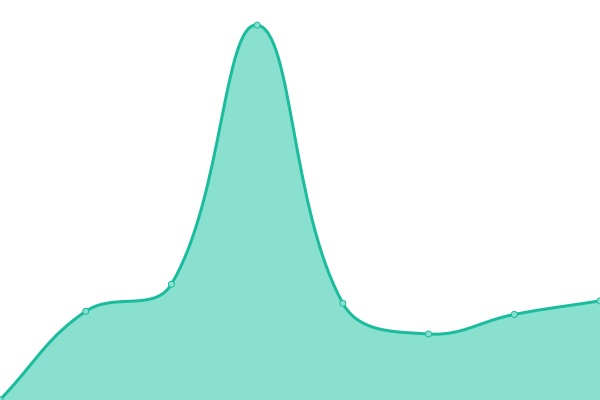
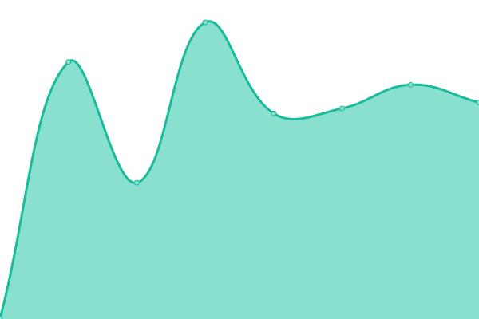

# [📈 Live Status](https://tracker.status.icon.community/): <!--live status--> **🟧 Partial outage**

This repository contains the uptime monitor and [status page](https://tracker.status.icon.community/) for [the ICON Blockchain's Tracker and associated endpoints.](https://tracker.icon.community/), powered by [Upptime](https://github.com/upptime/upptime).

With [Upptime](https://upptime.js.org), you can get your own unlimited and free uptime monitor and status page, powered entirely by a GitHub repository. We use [Issues](https://github.com/sudoblockio/icon-status-page/issues) as incident reports, [Actions](https://github.com/sudoblockio/icon-status-page/actions) as uptime monitors, and [Pages](https://status.icon.geometry.io) for the status page.

<!--start: status pages-->
<!-- This summary is generated by Upptime (https://github.com/upptime/upptime) -->
<!-- Do not edit this manually, your changes will be overwritten -->
<!-- prettier-ignore -->
| URL | Status | History | Response Time | Uptime |
| --- | ------ | ------- | ------------- | ------ |
|  [Prod Mainnet Tracker Frontend](https://tracker.icon.community/) | 🟩 Up | [prod-mainnet-tracker-frontend.yml](https://github.com/sudoblockio/icon-status-page/commits/HEAD/history/prod-mainnet-tracker-frontend.yml) | 

 564ms
     
 | 

<a href="https://tracker.status.icon.community/history/prod-mainnet-tracker-frontend">100.00%</a>
    

|  [Prod Mainnet API](https://tracker.icon.community/api/v1/logs?method=Remove&limit=100&address=cxa0af3165c08318e988cb30993b3048335b94af6c) | 🟩 Up | [prod-mainnet-api.yml](https://github.com/sudoblockio/icon-status-page/commits/HEAD/history/prod-mainnet-api.yml) | 

 568ms
     
 | 

<a href="https://tracker.status.icon.community/history/prod-mainnet-api">100.00%</a>
    

|  [Prod Mainnet Blocks Service (WS)](https://tracker.icon.community/ws/v1/blocks) | 🟩 Up | [prod-mainnet-blocks-service-ws.yml](https://github.com/sudoblockio/icon-status-page/commits/HEAD/history/prod-mainnet-blocks-service-ws.yml) | 

 0ms
     
 | 

<a href="https://tracker.status.icon.community/history/prod-mainnet-blocks-service-ws">100.00%</a>
    

|  [Prod Mainnet Governance Service](https://tracker.icon.community/api/v1/governance/preps) | 🟩 Up | [prod-mainnet-governance-service.yml](https://github.com/sudoblockio/icon-status-page/commits/HEAD/history/prod-mainnet-governance-service.yml) | 

 662ms
     
 | 

<a href="https://tracker.status.icon.community/history/prod-mainnet-governance-service">100.00%</a>
    

|  [Prod Mainnet Contracts Service](https://tracker.icon.community/api/v1/contracts) | 🟩 Up | [prod-mainnet-contracts-service.yml](https://github.com/sudoblockio/icon-status-page/commits/HEAD/history/prod-mainnet-contracts-service.yml) | 

 1380ms
     
 | 

<a href="https://tracker.status.icon.community/history/prod-mainnet-contracts-service">100.00%</a>
    

|  [Prod Mainnet API](https://tracker.icon.community/api/v1/blocks) | 🟩 Up | [prod-mainnet-api.yml](https://github.com/sudoblockio/icon-status-page/commits/HEAD/history/prod-mainnet-api.yml) | 

 568ms
     
 | 

<a href="https://tracker.status.icon.community/history/prod-mainnet-api">100.00%</a>
    

|  [Prod Mainnet Governance Service](https://tracker.icon.community/api/v1/governance/preps) | 🟩 Up | [prod-mainnet-governance-service.yml](https://github.com/sudoblockio/icon-status-page/commits/HEAD/history/prod-mainnet-governance-service.yml) | 

 662ms
     
 | 

<a href="https://tracker.status.icon.community/history/prod-mainnet-governance-service">100.00%</a>
    

|  [Prod Mainnet Contracts Service](https://tracker.icon.community/api/v1/contracts) | 🟩 Up | [prod-mainnet-contracts-service.yml](https://github.com/sudoblockio/icon-status-page/commits/HEAD/history/prod-mainnet-contracts-service.yml) | 

 1380ms
     
 | 

<a href="https://tracker.status.icon.community/history/prod-mainnet-contracts-service">100.00%</a>
    

|  [Prod Mainnet RPC](https://api.icon.community/api/v3) | 🟩 Up | [prod-mainnet-rpc.yml](https://github.com/sudoblockio/icon-status-page/commits/HEAD/history/prod-mainnet-rpc.yml) | 

 666ms
     
 | 

<a href="https://tracker.status.icon.community/history/prod-mainnet-rpc">100.00%</a>
    

|  [Prod Mainnet Cluster1 RPC](https://cluster1.api.mainnet.icon.community/api/v3) | 🟩 Up | [prod-mainnet-cluster1-rpc.yml](https://github.com/sudoblockio/icon-status-page/commits/HEAD/history/prod-mainnet-cluster1-rpc.yml) | 

 320ms
     
 | 

<a href="https://tracker.status.icon.community/history/prod-mainnet-cluster1-rpc">100.00%</a>
    

|  [Prod Mainnet Singapore RPC](https://api.mainnet.sng.vultr.icon.community/api/v3) | 🟩 Up | [prod-mainnet-singapore-rpc.yml](https://github.com/sudoblockio/icon-status-page/commits/HEAD/history/prod-mainnet-singapore-rpc.yml) | 

 873ms
     
 | 

<a href="https://tracker.status.icon.community/history/prod-mainnet-singapore-rpc">100.00%</a>
    

|  [Prod Lisbon RPC](https://api.lisbon.icon.community/api/v3) | 🟩 Up | [prod-lisbon-rpc.yml](https://github.com/sudoblockio/icon-status-page/commits/HEAD/history/prod-lisbon-rpc.yml) | 

 735ms
     
 | 

<a href="https://tracker.status.icon.community/history/prod-lisbon-rpc">100.00%</a>
    

|  [Prod Lisbon Cluster1 RPC](https://cluster1.api.lisbon.icon.community/api/v3) | 🟩 Up | [prod-lisbon-cluster1-rpc.yml](https://github.com/sudoblockio/icon-status-page/commits/HEAD/history/prod-lisbon-cluster1-rpc.yml) | 

 291ms
     
 | 

<a href="https://tracker.status.icon.community/history/prod-lisbon-cluster1-rpc">100.00%</a>
    

|  [Prod Lisbon Singapore RPC](https://api.lisbon.sng.vultr.icon.community/api/v3) | 🟩 Up | [prod-lisbon-singapore-rpc.yml](https://github.com/sudoblockio/icon-status-page/commits/HEAD/history/prod-lisbon-singapore-rpc.yml) | 

 783ms
     
 | 

<a href="https://tracker.status.icon.community/history/prod-lisbon-singapore-rpc">100.00%</a>
    

|  [Prod Berlin RPC](https://api.berlin.icon.community/api/v3) | 🟩 Up | [prod-berlin-rpc.yml](https://github.com/sudoblockio/icon-status-page/commits/HEAD/history/prod-berlin-rpc.yml) | 

 8141ms
     
 | 

<a href="https://tracker.status.icon.community/history/prod-berlin-rpc">4.16%</a>
    

|  [Prod Berlin Cluster1 RPC](https://cluster1.api.berlin.icon.community/api/v3) | 🟩 Up | [prod-berlin-cluster1-rpc.yml](https://github.com/sudoblockio/icon-status-page/commits/HEAD/history/prod-berlin-cluster1-rpc.yml) | 

 293ms
     
 | 

<a href="https://tracker.status.icon.community/history/prod-berlin-cluster1-rpc">100.00%</a>
    

|  [Prod Berlin Singapore RPC](https://api.berlin.sng.vultr.icon.community/api/v3) | 🟥 Down | [prod-berlin-singapore-rpc.yml](https://github.com/sudoblockio/icon-status-page/commits/HEAD/history/prod-berlin-singapore-rpc.yml) | 

 10713ms
     
 | 

<a href="https://tracker.status.icon.community/history/prod-berlin-singapore-rpc">0.00%</a>
    

<!--end: status pages-->

[**Visit our status website →**](https://status.icon.geometry.io)

## 📄 License

- Powered by: [Upptime](https://github.com/upptime/upptime)
- Code: [MIT](./LICENSE) © [Geometry Labs](https://status.icon.geometry.io)
- Data in the `./history` directory: [Open Database License](https://opendatacommons.org/licenses/odbl/1-0/)
